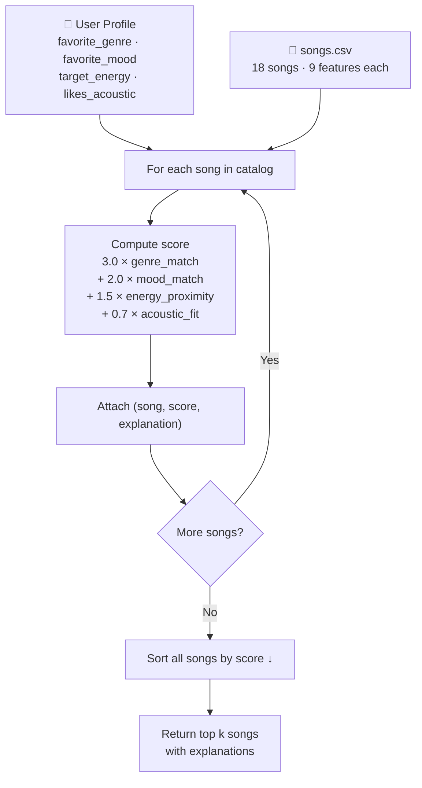

# 🎵 Music Recommender Simulation

## Project Summary

In this project you will build and explain a small music recommender system.

Your goal is to:

- Represent songs and a user "taste profile" as data
- Design a scoring rule that turns that data into recommendations
- Evaluate what your system gets right and wrong
- Reflect on how this mirrors real world AI recommenders

This simulation builds a content-based music recommender that scores every song in an 18-song catalog against a user's stated taste profile and returns the top matches. It models three of the same signals real platforms use — genre identity, mood alignment, and energy proximity — in a transparent, single-function scoring rule with explicit weights. The goal is to make the recommendation logic fully inspectable: every score can be broken down into its components and explained in plain language.

---

## How The System Works

Real-world recommenders like Spotify combine two strategies: collaborative filtering (finding users with similar taste and borrowing their history) and content-based filtering (matching the audio features of songs you already liked). This simulation focuses on **content-based filtering** — it scores every song in the catalog against a user's stated preferences and surfaces the closest matches. Rather than learning from many users' behavior, it relies entirely on what we know about the song itself: its genre, mood, and measured audio properties. The system prioritizes **vibe alignment** — matching the emotional energy and texture of what a user is looking for — over novelty or diversity.

### Features used by each `Song`

| Feature | Type | Role |
|---|---|---|
| `genre` | string | Categorical match — strongest filter |
| `mood` | string | Categorical match — emotional intent |
| `energy` | float (0–1) | Proximity score — intensity alignment |
| `valence` | float (0–1) | Proximity score — happy vs. melancholy |
| `danceability` | float (0–1) | Proximity score — rhythmic feel |
| `acousticness` | float (0–1) | Proximity score — organic vs. electronic texture |
| `tempo_bpm` | float | Available in data; not yet weighted in v1 |

### Information stored in `UserProfile`

- `favorite_genre` — used for categorical genre matching
- `favorite_mood` — used for categorical mood matching
- `target_energy` — the energy level the user wants right now
- `likes_acoustic` — boolean preference for organic vs. produced sound

### How a score is computed

Each song receives a weighted score:

```
score = 3.0 × genre_match
      + 2.0 × mood_match
      + 1.5 × (1 - |song.energy - user.target_energy|)
      + 1.0 × (1 - |song.valence - user.target_valence|)
      + 0.7 × acousticness_score
```

Categorical features return `1.0` on match, `0.0` otherwise. Numerical features use a proximity formula so songs *closer* to the user's preference score higher — not just songs with higher raw values.

### How songs are chosen

The scoring rule is applied to every song in the catalog independently. The ranking rule then sorts all songs by score (descending) and returns the top `k`. The two steps are kept separate so the scoring logic can be tested and adjusted without changing how the final list is assembled.

---

## Algorithm Recipe (Finalized)

### Weights and Rationale

| Feature | Weight | Type | Why this weight |
|---|---|---|---|
| `genre` | **3.0** | categorical (0 or 1) | Strongest signal — genre defines the entire sonic universe; rock and lofi are incompatible regardless of mood |
| `mood` | **2.0** | categorical (0 or 1) | Second strongest — sets emotional intent; "chill" and "intense" require different contexts |
| `energy` | **1.5** | proximity `1 - \|Δ\|` | High variance in the dataset (0.18–0.97); close match matters for workout vs. study |
| `acousticness` | **0.7** | proximity or boolean | Captures organic vs. electronic texture, a dimension energy alone misses |

**Full formula:**
```
score = 3.0 × genre_match
      + 2.0 × mood_match
      + 1.5 × (1 − |song.energy − user.target_energy|)
      + 0.7 × (song.acousticness  if likes_acoustic  else  1 − song.acousticness)
```

### Example User Profiles

**"Late Night Focus"**
```python
UserProfile(favorite_genre="lofi", favorite_mood="focused",
            target_energy=0.40, likes_acoustic=True)
```
Expected top songs: Focus Flow (9), Library Rain (4), Midnight Coding (2) — all lofi/chill/low-energy.
This profile clearly separates "intense rock" (Storm Runner scores ≈ 1.7) from "chill lofi" (Focus Flow scores ≈ 7.1) because genre mismatch alone costs 3.0 points and energy gap adds another ~0.75 penalty.

**"Morning Run"**
```python
UserProfile(favorite_genre="edm", favorite_mood="euphoric",
            target_energy=0.95, likes_acoustic=False)
```
Expected top songs: Signal Peak (17), Gym Hero (5), City Heights (11).

**Critique of the profile shape:** A profile with one `favorite_genre` and one `favorite_mood` is intentionally narrow. It cannot express "I'm ok with hip-hop *or* edm" or "any high-energy genre works." For a real system, this would be replaced by a taste vector learned from listening history. For this simulation, the narrowness is a feature — it makes the scoring logic easy to trace and verify.

---

## Data Flow



---

## Expected Biases

- **Genre dominance:** A genre weight of 3.0 means a perfect genre match always beats any non-matching song, even if the non-matching song is a near-perfect fit on every other dimension. A great ambient track will never surface for a lofi user.
- **Mood rigidity:** The binary mood match (1.0 or 0.0) treats "relaxed" and "chill" as completely different, even though a human listener might find them interchangeable.
- **Catalog skew:** With only 18 songs, some genres appear once. A reggae user will always get Harbour Sun at the top regardless of whether it truly fits — there's no alternative.
- **No novelty:** The system always recommends the closest match. It will never suggest a surprising discovery that happens to work, the way Spotify's Discover Weekly intentionally does.

---

## Getting Started

### Setup

1. Create a virtual environment (optional but recommended):

   ```bash
   python -m venv .venv
   source .venv/bin/activate      # Mac or Linux
   .venv\Scripts\activate         # Windows

2. Install dependencies

```bash
pip install -r requirements.txt
```

3. Run the app:

```bash
python -m src.main
```

### Running Tests

Run the starter tests with:

```bash
pytest
```

You can add more tests in `tests/test_recommender.py`.

---

## Experiments You Tried

Use this section to document the experiments you ran. For example:

- What happened when you changed the weight on genre from 2.0 to 0.5
- What happened when you added tempo or valence to the score
- How did your system behave for different types of users

---

## Limitations and Risks

Summarize some limitations of your recommender.

Examples:

- It only works on a tiny catalog
- It does not understand lyrics or language
- It might over favor one genre or mood

You will go deeper on this in your model card.

---

## Reflection

Read and complete `model_card.md`:

[**Model Card**](model_card.md)

Building VibeFinder taught me that a recommendation is not magic — it is just arithmetic dressed up as a ranked list. Every song gets a score from four weighted comparisons, the list gets sorted, and the top five get returned. What makes it *feel* like a real recommendation is the explanation attached to each result: "genre match (+3.0), energy proximity (+1.47)" reads like something a human curator would say, even though it came from five lines of math. That gap between how a system *works* and how it *feels* to a user is probably the most important thing I learned from this project, because it applies to every AI product — not just music.

The bias findings were the most surprising part. I expected the system to degrade gracefully when given conflicting preferences, but running the adversarial profile (a blues fan who wanted high energy) showed the opposite: the genre and mood bonus combined (5.0 points) was so much larger than the maximum energy penalty (about 0.86 points) that the system confidently returned a low-energy song as the perfect match. That is not a bug — it is a direct consequence of the weights I chose. It showed me that every design decision about a weight or a threshold is also a decision about whose preferences get honored and whose get overruled. In a real system serving millions of users, those decisions have real consequences for people whose taste doesn't fit the majority pattern the weights were tuned for.


---

## 🎧 Model Card - Music Recommender Simulation

### 1. Model Name

**VibeFinder 1.0**

---

### 2. Intended Use

This model suggests up to 5 songs from an 18-song catalog based on a user's preferred genre, mood, energy level, and acoustic texture preference. It is built for classroom exploration of content-based filtering concepts — not for real users or production use. It assumes the user can describe their taste with a single genre and mood label that matches the catalog exactly.

---

### 3. How It Works (Short Explanation)

Every song in the catalog is compared to what the user says they want across four features, and each comparison earns points:

- **Genre** earns up to 3 points — the biggest reward, because genre defines the entire sound world of a song. Rock and lofi are fundamentally different even if they share a mood.
- **Mood** earns up to 2 points — if the song's emotional tone (happy, chill, intense, sad, etc.) matches what the user asked for, it gets the full 2 points; otherwise zero.
- **Energy** earns up to 1.5 points — the closer a song's energy is to the user's target (on a 0 to 1 scale), the more points it earns. A workout user who wants high energy gets penalized for quiet songs and rewarded for close matches.
- **Acoustic texture** earns up to 0.7 points — if the user prefers acoustic-sounding music, organic-sounding songs score higher. If they prefer electronic sound, the opposite applies.

All songs are scored independently, ranked from highest to lowest, and the top five are returned with a plain-language breakdown of why each song earned its score.

---

### 4. Data

The catalog contains **18 songs** across **14 genres** (pop, lofi, rock, ambient, jazz, synthwave, indie pop, hip-hop, r&b, metal, classical, reggae, folk, edm, blues) and **14 moods** (happy, chill, intense, relaxed, focused, moody, hype, romantic, angry, melancholic, uplifting, nostalgic, euphoric, sad).

Ten songs came from the starter dataset. Eight were added in Phase 2 to cover genres and moods that were missing. Most rare genres (blues, reggae, metal, classical, folk, r&b, hip-hop, edm) have only one song each. The data reflects a narrow Western perspective — non-Western genres like Afrobeats, cumbia, K-pop, or Bollywood are entirely absent. Feature values like energy and acousticness were assigned by the developer rather than measured from audio, so they are estimates.

---

### 5. Strengths

- **Works well for users whose genre is in the catalog.** Profile A (pop/happy) correctly returned Sunrise City as the top result with a score of 7.04 — three out of four features aligned perfectly.
- **Energy proximity captures context correctly.** A "Chill Lofi Study" user (energy target 0.40) got Focus Flow as the top result with a near-perfect energy match (0.40 vs 0.40), correctly separating study music from workout music.
- **Fully transparent.** Every score breaks down into its four components with exact point values. There are no hidden weights or black-box steps — anyone can look at the output and understand exactly why a song ranked where it did.
- **Graceful fallback.** When a user's genre is missing from the catalog entirely (tested with "country"), the system still returns reasonable results using mood and energy signals rather than failing silently.

---

### 6. Limitations and Bias

**Genre dominates everything.** The genre and mood bonus combined can reach 5.0 points, while the worst-case energy mismatch only costs about 0.86 points. This means a genre-matching song will always rank first even if its energy is the complete opposite of what the user wants. A "high-energy blues" user got a low-energy (0.33) song ranked #1 because of genre alone.

**Single-song genre trap.** Eight of the 14 genres have only one song. Users of those genres will always get the same recommendation at #1 regardless of how wrong the energy or mood fit is — there is no alternative in the catalog.

**Binary mood matching ignores near-synonyms.** "Chill" and "relaxed" earn zero shared points even though most listeners find them interchangeable. A jazz user wanting "chill" music gets penalized for Coffee Shop Stories (mood: "relaxed") despite it being an obvious match.

**Silent defaults.** If a user does not specify `likes_acoustic`, it defaults to `False`, quietly biasing every score toward electronic-sounding songs without the user knowing.

---

### 7. Evaluation

Five user profiles were tested:

| Profile | Top result | Score | Finding |
|---|---|---|---|
| High-Energy Pop (pop / happy / 0.8) | Sunrise City | 7.04 | Correct — 3 of 4 features matched |
| Chill Lofi Study (lofi / focused / 0.4) | Focus Flow | 7.05 | Correct — near-perfect energy alignment |
| Deep Intense Rock (rock / intense / 0.9) | Storm Runner | 7.11 | Correct — only rock/intense song in catalog |
| Adversarial: Blues + high energy (0.9) | Empty Porch Blues | 5.76 | Surprising — genre+mood overrode a 0.57 energy mismatch |
| Edge case: Country (not in catalog) | Rooftop Lights | 3.50 | Reasonable fallback; low scores signal low confidence |

One weight experiment was run: genre weight lowered from 3.0 to 1.5, energy weight raised from 1.5 to 3.0. Rooftop Lights leapfrogged Gym Hero for the pop profile because its energy (0.76) was closer to the target (0.80) than Gym Hero's (0.93). This confirmed the default system is genre-first, not vibe-first.

---

### 8. Future Work

- **Soft mood matching** — build a similarity map so "chill" and "relaxed" earn partial credit instead of zero, fixing the most common source of near-misses within a genre
- **Multi-value genre preferences** — allow `genre: ["lofi", "ambient"]` so users can express overlapping taste without being locked into one label
- **Per-user learned weights** — after a few listening events (skips and completions), adjust each user's genre/energy/mood weights automatically rather than using the same fixed values for everyone

---

### 9. Personal Reflection

The most surprising thing about building VibeFinder was discovering that a recommendation can *feel* right even when the logic behind it is just five lines of arithmetic. The explanation string — "genre match (+3.0), energy proximity (+1.47)" — reads like something a human curator would say, even though it is a direct printout of a score formula. That gap between how a system *works* and how confident it *sounds* is something I now notice in real apps too.

Building this also changed how I think about Spotify and YouTube recommendations. Those systems feel authoritative and personalized, but they are making the same basic tradeoffs: how much weight to put on what you say you like versus what you actually skip, how to balance familiarity with discovery, and whose taste the default weights were tuned for. The adversarial test — where a blues fan who wanted high energy got a low-energy song ranked first — showed that every weight is also a quiet value judgment about what matters most. Human judgment still matters most when setting those weights, because math can rank correctly and still be unfair to users whose preferences fall outside the patterns the weights were designed for.
