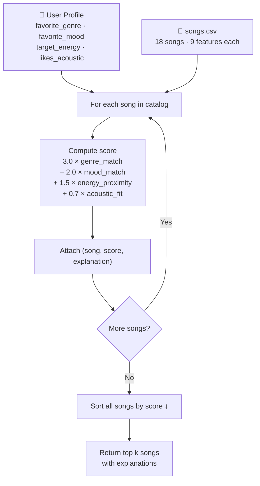

# 🎵 Music Recommender Simulation

## Project Summary

In this project you will build and explain a small music recommender system.

Your goal is to:

- Represent songs and a user "taste profile" as data
- Design a scoring rule that turns that data into recommendations
- Evaluate what your system gets right and wrong
- Reflect on how this mirrors real world AI recommenders

This simulation builds a content-based music recommender that scores every song in an 18-song catalog against a user's stated taste profile and returns the top matches. It models three of the same signals real platforms use — genre identity, mood alignment, and energy proximity — in a transparent, single-function scoring rule with explicit weights. The goal is to make the recommendation logic fully inspectable: every score can be broken down into its components and explained in plain language.

---

## How The System Works

Real-world recommenders like Spotify combine two strategies: collaborative filtering (finding users with similar taste and borrowing their history) and content-based filtering (matching the audio features of songs you already liked). This simulation focuses on **content-based filtering** — it scores every song in the catalog against a user's stated preferences and surfaces the closest matches. Rather than learning from many users' behavior, it relies entirely on what we know about the song itself: its genre, mood, and measured audio properties. The system prioritizes **vibe alignment** — matching the emotional energy and texture of what a user is looking for — over novelty or diversity.

### Features used by each `Song`

| Feature | Type | Role |
|---|---|---|
| `genre` | string | Categorical match — strongest filter |
| `mood` | string | Categorical match — emotional intent |
| `energy` | float (0–1) | Proximity score — intensity alignment |
| `valence` | float (0–1) | Proximity score — happy vs. melancholy |
| `danceability` | float (0–1) | Proximity score — rhythmic feel |
| `acousticness` | float (0–1) | Proximity score — organic vs. electronic texture |
| `tempo_bpm` | float | Available in data; not yet weighted in v1 |

### Information stored in `UserProfile`

- `favorite_genre` — used for categorical genre matching
- `favorite_mood` — used for categorical mood matching
- `target_energy` — the energy level the user wants right now
- `likes_acoustic` — boolean preference for organic vs. produced sound

### How a score is computed

Each song receives a weighted score:

```
score = 3.0 × genre_match
      + 2.0 × mood_match
      + 1.5 × (1 - |song.energy - user.target_energy|)
      + 1.0 × (1 - |song.valence - user.target_valence|)
      + 0.7 × acousticness_score
```

Categorical features return `1.0` on match, `0.0` otherwise. Numerical features use a proximity formula so songs *closer* to the user's preference score higher — not just songs with higher raw values.

### How songs are chosen

The scoring rule is applied to every song in the catalog independently. The ranking rule then sorts all songs by score (descending) and returns the top `k`. The two steps are kept separate so the scoring logic can be tested and adjusted without changing how the final list is assembled.

---

## Algorithm Recipe (Finalized)

### Weights and Rationale

| Feature | Weight | Type | Why this weight |
|---|---|---|---|
| `genre` | **3.0** | categorical (0 or 1) | Strongest signal — genre defines the entire sonic universe; rock and lofi are incompatible regardless of mood |
| `mood` | **2.0** | categorical (0 or 1) | Second strongest — sets emotional intent; "chill" and "intense" require different contexts |
| `energy` | **1.5** | proximity `1 - \|Δ\|` | High variance in the dataset (0.18–0.97); close match matters for workout vs. study |
| `acousticness` | **0.7** | proximity or boolean | Captures organic vs. electronic texture, a dimension energy alone misses |

**Full formula:**
```
score = 3.0 × genre_match
      + 2.0 × mood_match
      + 1.5 × (1 − |song.energy − user.target_energy|)
      + 0.7 × (song.acousticness  if likes_acoustic  else  1 − song.acousticness)
```

### Example User Profiles

**"Late Night Focus"**
```python
UserProfile(favorite_genre="lofi", favorite_mood="focused",
            target_energy=0.40, likes_acoustic=True)
```
Expected top songs: Focus Flow (9), Library Rain (4), Midnight Coding (2) — all lofi/chill/low-energy.
This profile clearly separates "intense rock" (Storm Runner scores ≈ 1.7) from "chill lofi" (Focus Flow scores ≈ 7.1) because genre mismatch alone costs 3.0 points and energy gap adds another ~0.75 penalty.

**"Morning Run"**
```python
UserProfile(favorite_genre="edm", favorite_mood="euphoric",
            target_energy=0.95, likes_acoustic=False)
```
Expected top songs: Signal Peak (17), Gym Hero (5), City Heights (11).

**Critique of the profile shape:** A profile with one `favorite_genre` and one `favorite_mood` is intentionally narrow. It cannot express "I'm ok with hip-hop *or* edm" or "any high-energy genre works." For a real system, this would be replaced by a taste vector learned from listening history. For this simulation, the narrowness is a feature — it makes the scoring logic easy to trace and verify.

---

## Data Flow



---

## Expected Biases

- **Genre dominance:** A genre weight of 3.0 means a perfect genre match always beats any non-matching song, even if the non-matching song is a near-perfect fit on every other dimension. A great ambient track will never surface for a lofi user.
- **Mood rigidity:** The binary mood match (1.0 or 0.0) treats "relaxed" and "chill" as completely different, even though a human listener might find them interchangeable.
- **Catalog skew:** With only 18 songs, some genres appear once. A reggae user will always get Harbour Sun at the top regardless of whether it truly fits — there's no alternative.
- **No novelty:** The system always recommends the closest match. It will never suggest a surprising discovery that happens to work, the way Spotify's Discover Weekly intentionally does.

---

## Getting Started

### Setup

1. Create a virtual environment (optional but recommended):

   ```bash
   python -m venv .venv
   source .venv/bin/activate      # Mac or Linux
   .venv\Scripts\activate         # Windows

2. Install dependencies

```bash
pip install -r requirements.txt
```

3. Run the app:

```bash
python -m src.main
```

### Running Tests

Run the starter tests with:

```bash
pytest
```

You can add more tests in `tests/test_recommender.py`.

---

## Experiments You Tried

Use this section to document the experiments you ran. For example:

- What happened when you changed the weight on genre from 2.0 to 0.5
- What happened when you added tempo or valence to the score
- How did your system behave for different types of users

---

## Limitations and Risks

Summarize some limitations of your recommender.

Examples:

- It only works on a tiny catalog
- It does not understand lyrics or language
- It might over favor one genre or mood

You will go deeper on this in your model card.

---

## Reflection

Read and complete `model_card.md`:

[**Model Card**](model_card.md)

Write 1 to 2 paragraphs here about what you learned:

- about how recommenders turn data into predictions
- about where bias or unfairness could show up in systems like this


---

## 7. `model_card_template.md`

Combines reflection and model card framing from the Module 3 guidance. :contentReference[oaicite:2]{index=2}  

```markdown
# 🎧 Model Card - Music Recommender Simulation

## 1. Model Name

Give your recommender a name, for example:

> VibeFinder 1.0

---

## 2. Intended Use

- What is this system trying to do
- Who is it for

Example:

> This model suggests 3 to 5 songs from a small catalog based on a user's preferred genre, mood, and energy level. It is for classroom exploration only, not for real users.

---

## 3. How It Works (Short Explanation)

Describe your scoring logic in plain language.

- What features of each song does it consider
- What information about the user does it use
- How does it turn those into a number

Try to avoid code in this section, treat it like an explanation to a non programmer.

---

## 4. Data

Describe your dataset.

- How many songs are in `data/songs.csv`
- Did you add or remove any songs
- What kinds of genres or moods are represented
- Whose taste does this data mostly reflect

---

## 5. Strengths

Where does your recommender work well

You can think about:
- Situations where the top results "felt right"
- Particular user profiles it served well
- Simplicity or transparency benefits

---

## 6. Limitations and Bias

Where does your recommender struggle

Some prompts:
- Does it ignore some genres or moods
- Does it treat all users as if they have the same taste shape
- Is it biased toward high energy or one genre by default
- How could this be unfair if used in a real product

---

## 7. Evaluation

How did you check your system

Examples:
- You tried multiple user profiles and wrote down whether the results matched your expectations
- You compared your simulation to what a real app like Spotify or YouTube tends to recommend
- You wrote tests for your scoring logic

You do not need a numeric metric, but if you used one, explain what it measures.

---

## 8. Future Work

If you had more time, how would you improve this recommender

Examples:

- Add support for multiple users and "group vibe" recommendations
- Balance diversity of songs instead of always picking the closest match
- Use more features, like tempo ranges or lyric themes

---

## 9. Personal Reflection

A few sentences about what you learned:

- What surprised you about how your system behaved
- How did building this change how you think about real music recommenders
- Where do you think human judgment still matters, even if the model seems "smart"

